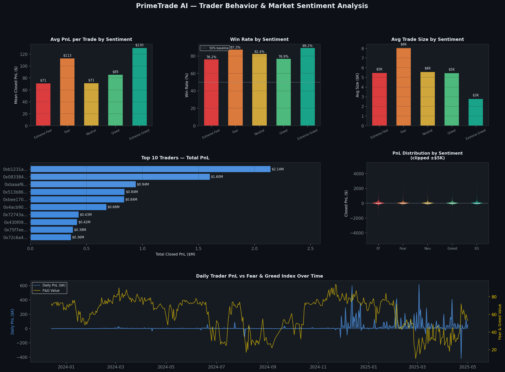
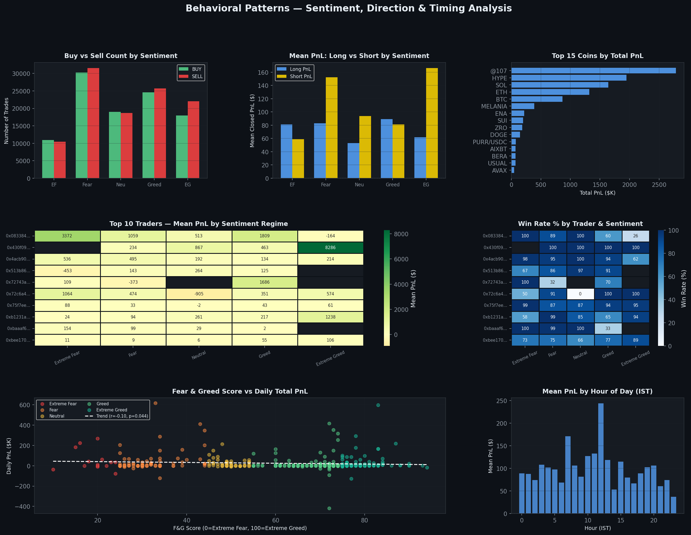
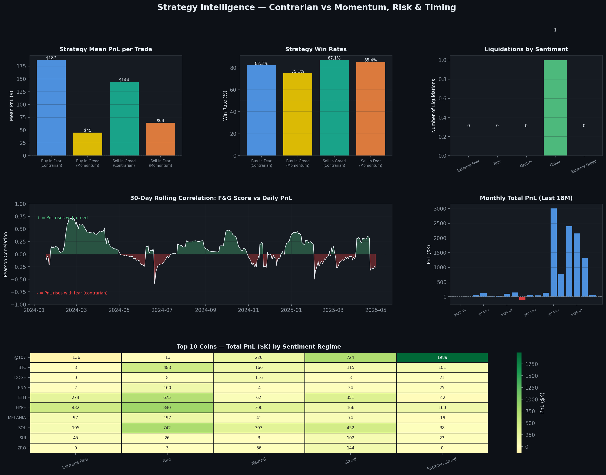

# PrimeTrade AI — Trader Behavior & Market Sentiment Analysis

Analysis of 211,224 trades across 32 Hyperliquid traders merged with the Bitcoin Fear & Greed Index (May 2023 – May 2025).

## Key Findings
- Extreme Greed regime: highest avg PnL ($130/trade, 89% win rate)
- Fear regime: traders take largest positions ($8K avg size) — contrarian behavior
- Top 3 traders account for 45% of all PnL ($10.3M total)
- Weak negative correlation (r=-0.098) between F&G and PnL — contrarian edge exists

## Charts

## Run it yourself
pip install pandas numpy matplotlib seaborn scipy
python analysis.py
